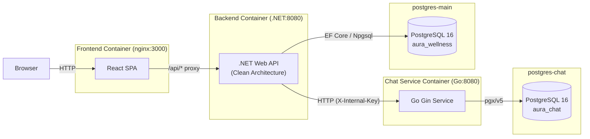
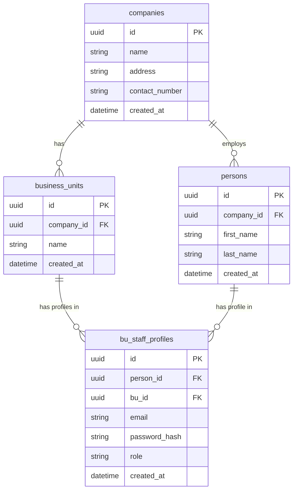
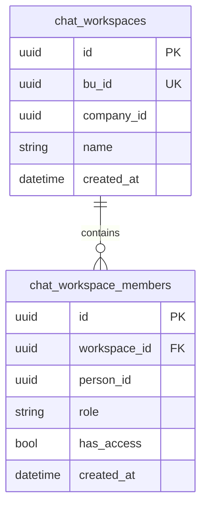
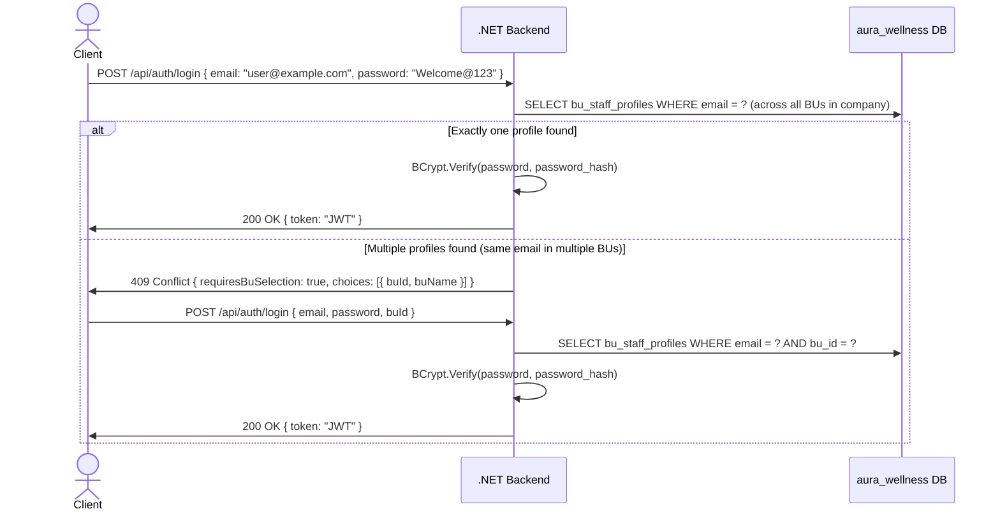
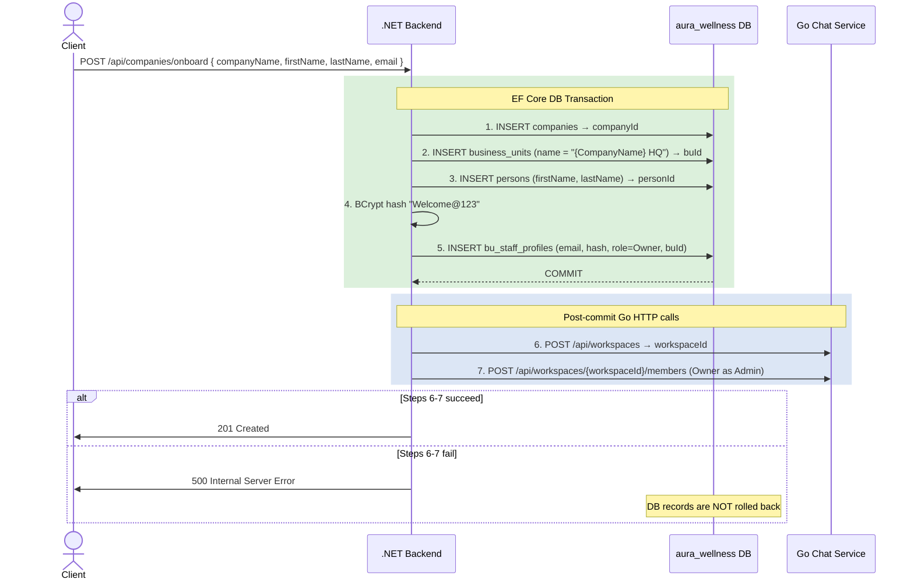

# Aura Wellness — System Design

## Table of Contents

1. [Tech Stack](#tech-stack)
2. [Architecture Overview](#architecture-overview)
3. [ER Diagrams](#er-diagrams)
4. [Multi-Tenancy Strategy](#multi-tenancy-strategy)
5. [Authentication & Authorization Flow](#authentication--authorization-flow)
6. [Onboarding Flow](#onboarding-flow)
7. [API Reference](#api-reference)
8. [Key Architectural Trade-offs](#key-architectural-trade-offs)

---

## Tech Stack

| Layer | Technology |
|---|---|
| Frontend | React 19, TypeScript, Vite, TailwindCSS v4, TanStack Query, React Router v6 |
| Backend | .NET 10 Web API, Clean Architecture, EF Core + Npgsql, JWT Bearer |
| Chat Microservice | Go (Gin, pgx/v5, golang-migrate) |
| Databases | PostgreSQL 16 — two isolated instances: `aura_wellness`, `aura_chat` |
| Containers | Docker Compose |

---

## Architecture Overview



All browser traffic hits the nginx-served React SPA. Requests to `/api/*` are reverse-proxied by nginx to the .NET backend. The .NET backend owns the main PostgreSQL database directly and calls the Go chat service over HTTP for all chat-related operations.

---

## ER Diagrams

### Main Platform DB (`aura_wellness`)



Notes:
- `bu_staff_profiles.role` is an enum: `Owner`, `Admin`, `Staff`
- `UNIQUE(bu_id, email)` constraint prevents duplicate profiles within the same business unit
- `persons` and `bu_staff_profiles` are distinct: a person may hold profiles across multiple BUs

### Chat Service DB (`aura_chat`)



Notes:
- `chat_workspaces.bu_id` is `UNIQUE` — one workspace per business unit
- `chat_workspace_members.role` is an enum: `Admin`, `Member`
- `chat_workspace_members.has_access` defaults to `false` — access must be explicitly granted by an Owner
- `UNIQUE(workspace_id, person_id)` prevents duplicate membership records

---

## Multi-Tenancy Strategy

Aura Wellness uses a **shared schema with a `company_id` discriminator** for multi-tenancy.

- All tenant-scoped tables (`companies`, `business_units`, `persons`) carry a `company_id` column.
- Every repository method accepts and always filters by `companyId`, which is extracted from the authenticated JWT claim.
- There is no PostgreSQL row-level security (RLS) at the database level — this is an explicit MVP scope decision.
- Tenant isolation is enforced entirely at the application layer in the .NET backend.

This approach keeps operational complexity low (single schema, single database connection pool) while remaining straightforward to audit — every query that touches tenant data must pass through a repository that enforces the `companyId` filter.

---

## Authentication & Authorization Flow



### JWT Claims Structure

```json
{
  "sub": "<bu_staff_profile_id>",
  "companyId": "<company_id>",
  "personId": "<person_id>",
  "buId": "<business_unit_id>",
  "role": "Owner | Admin | Staff",
  "exp": "<unix_timestamp>"
}
```

Role-based access is enforced per endpoint using the `role` claim. The `companyId` claim is the primary tenant discriminator used in all downstream repository calls.

---

## Onboarding Flow

Company onboarding is handled by `POST /api/companies/onboard` and is split into two phases: a database transaction and subsequent out-of-transaction Go HTTP calls.



### Transaction Boundary Notes

- Steps 1-5 run inside a single EF Core `IDbContextTransaction`. If any step fails, the entire transaction rolls back and no data is persisted.
- Steps 6-7 execute after the transaction is committed. If either Go HTTP call fails, the .NET backend returns a 500 to the client, but the already-committed database records in `aura_wellness` are not rolled back.
- This is an acknowledged MVP trade-off: a compensating transaction or saga pattern would be required for full distributed consistency.
- The default password `Welcome@123` is hardcoded and used for all newly created staff accounts. Owners are expected to prompt users to change their password on first login.

---

## API Reference

### .NET Backend

Base path: `/api` (proxied from nginx)

| Method | Path | Auth | Description |
|---|---|---|---|
| `POST` | `/api/companies/onboard` | Public | Full company + owner account setup |
| `POST` | `/api/auth/login` | Public | Login with email/password, returns JWT |
| `GET` | `/api/business-units` | Any authenticated | List all BUs for the caller's company |
| `POST` | `/api/business-units` | Owner | Create a new BU and provision a chat workspace |
| `GET` | `/api/staff` | Owner, Admin | List all staff (persons + profiles) in the company |
| `POST` | `/api/staff` | Owner | Create a person and their BU staff profile |
| `PUT` | `/api/staff/{personId}/role` | Owner | Update a staff member's role |
| `GET` | `/api/chat/workspace/{buId}` | Any authenticated | Get chat workspace info and member list |
| `PUT` | `/api/chat/workspace/{buId}/members/{personId}/access` | Owner | Grant or revoke chat access for a member |

### Go Chat Service

The chat service is internal and not directly exposed to the browser. All calls originate from the .NET backend and are authenticated with a shared `X-Internal-Key` header.

Base path: `/api`

| Method | Path | Description |
|---|---|---|
| `POST` | `/api/workspaces` | Create a new chat workspace |
| `GET` | `/api/workspaces/bu/:buId` | Get a workspace by its associated BU ID |
| `GET` | `/api/workspaces/:id/members` | List all members of a workspace |
| `POST` | `/api/workspaces/:id/members` | Add a member to a workspace |
| `PUT` | `/api/workspaces/:id/members/:personId` | Update a member's role or access flag |

---

## Key Architectural Trade-offs

| Decision | Choice | Rationale |
|---|---|---|
| Multi-tenancy model | Shared schema + `company_id` discriminator | Simpler operations and deployment for MVP; avoids schema-per-tenant complexity |
| Inter-service communication | Synchronous REST (HTTP) | No message broker infrastructure required; acceptable latency for MVP onboarding flows |
| Chat DB isolation | Separate PostgreSQL instance (`aura_chat`) | Enforces a clean service boundary; chat service owns its own data and schema migrations |
| Onboarding transaction boundary | DB transaction for steps 1-5; Go calls after commit | Ensures core tenant data is consistent; Go failures return 500 but do not corrupt main DB state |
| JWT storage (frontend) | `localStorage` | Simple implementation for assessment context; XSS risk is acknowledged and noted |
| Default password | `Welcome@123` (hardcoded constant) | Explicit and easily auditable during code review; not suitable for production |
| Chat member provisioning on staff creation | Auto-add with `has_access = false` | Ensures all staff are represented in chat; Owner must make a deliberate action to grant access |
