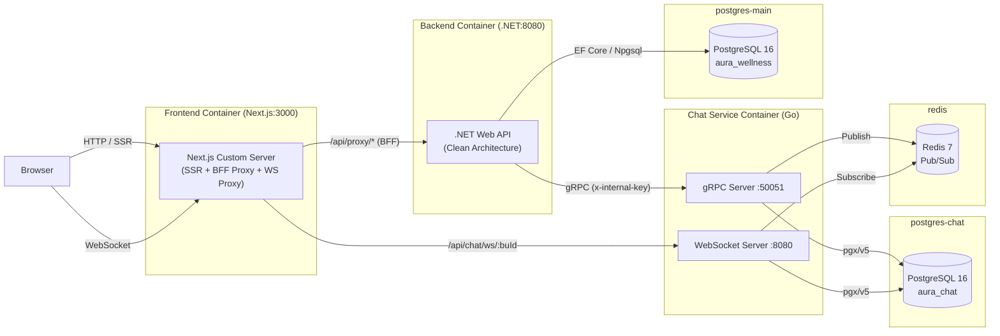
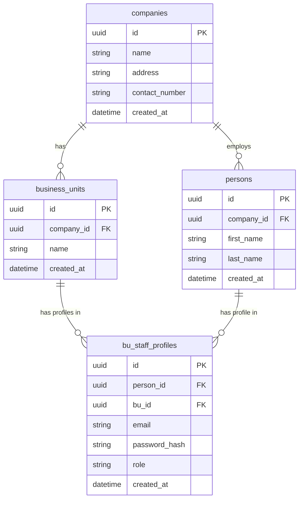
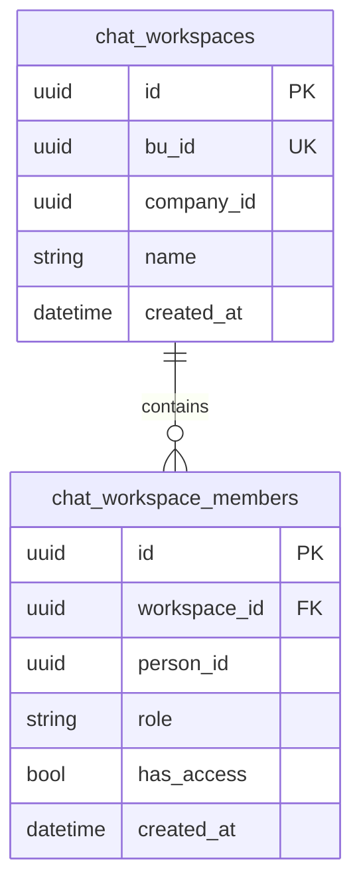
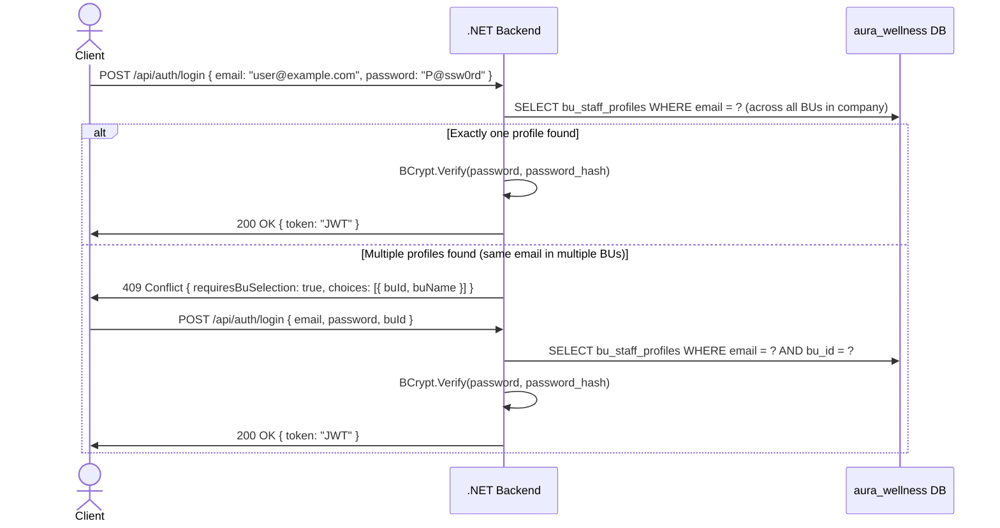
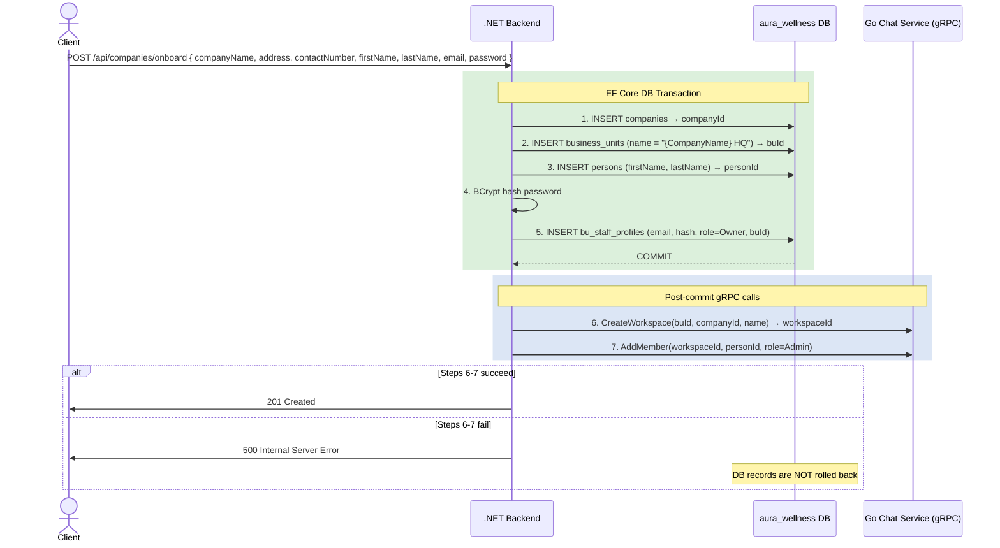
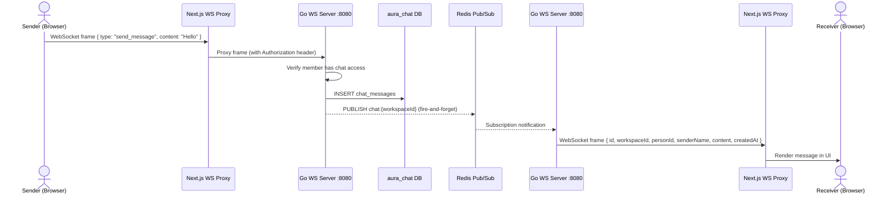

# Aura Wellness — System Design

## Table of Contents

1. [Tech Stack](#tech-stack)
2. [Architecture Overview](#architecture-overview)
3. [ER Diagrams](#er-diagrams)
4. [Multi-Tenancy Strategy](#multi-tenancy-strategy)
5. [Authentication & Authorization Flow](#authentication--authorization-flow)
6. [Onboarding Flow](#onboarding-flow)
7. [Real-Time Chat Architecture](#real-time-chat-architecture)
8. [API Reference](#api-reference)
9. [Key Architectural Trade-offs](#key-architectural-trade-offs)

---

## Tech Stack

| Layer | Technology |
|---|---|
| Frontend | Next.js 16, React 19, TypeScript, Ant Design, Zustand, Tailwind CSS v4 |
| Backend | .NET 10 Web API, Clean Architecture, EF Core 10 + Npgsql, JWT Bearer, gRPC Client |
| Chat Microservice | Go (gRPC, WebSocket, pgx/v5, golang-migrate, Redis pub/sub) |
| Databases | PostgreSQL 16 — two isolated instances: `aura_wellness`, `aura_chat` |
| Cache / Pub-Sub | Redis 7 — real-time chat message streaming |
| Containers | Docker Compose |

---

## Architecture Overview



### Request Flow

1. **Browser → Next.js**: All traffic enters through the Next.js custom server on port 3000.
2. **BFF Proxy**: API calls from the client go through `/api/proxy/*` route handlers, which read the JWT from an httpOnly cookie and inject it as a Bearer token before forwarding to the .NET backend.
3. **WebSocket Proxy**: Real-time chat connections to `/api/chat/ws/:buId` are upgraded server-side. The custom server reads the httpOnly cookie, opens a backend WebSocket to the Go chat service with the Authorization header, and bidirectionally proxies frames.
4. **Backend → Chat Service**: The .NET backend communicates with the Go chat service via gRPC for workspace/member management operations. An `x-internal-key` header authenticates these calls.
5. **Real-Time Flow**: When a message is sent, the Go chat service persists it to PostgreSQL and publishes to Redis. WebSocket subscribers on the same workspace channel receive the message in real-time.

---

## ER Diagrams

### Main Platform DB (`aura_wellness`)



Notes:
- `bu_staff_profiles.role` is an enum: `Owner`, `Admin`, `Staff`
- `UNIQUE(bu_id, email)` constraint prevents duplicate profiles within the same business unit
- `persons` and `bu_staff_profiles` are distinct: a person may hold profiles across multiple BUs

### Chat Service DB (`aura_chat`)



Notes:
- `chat_workspaces.bu_id` is `UNIQUE` — one workspace per business unit
- `chat_workspace_members.role` is an enum: `Admin`, `Member`
- `chat_workspace_members.has_access` defaults to `false` — access must be explicitly granted by an Owner
- `UNIQUE(workspace_id, person_id)` prevents duplicate membership records

---

## Multi-Tenancy Strategy

Aura Wellness uses a **shared schema with a `company_id` discriminator** for multi-tenancy.

- All tenant-scoped tables (`companies`, `business_units`, `persons`) carry a `company_id` column.
- Every repository method accepts and always filters by `companyId`, which is extracted from the authenticated JWT claim.
- There is no PostgreSQL row-level security (RLS) at the database level — this is an explicit MVP scope decision.
- Tenant isolation is enforced entirely at the application layer in the .NET backend.

This approach keeps operational complexity low (single schema, single database connection pool) while remaining straightforward to audit — every query that touches tenant data must pass through a repository that enforces the `companyId` filter.

---

## Authentication & Authorization Flow



### JWT Claims Structure

```json
{
  "sub": "<bu_staff_profile_id>",
  "companyId": "<company_id>",
  "personId": "<person_id>",
  "buId": "<business_unit_id>",
  "role": "Owner | Admin | Staff",
  "exp": "<unix_timestamp>"
}
```

Role-based access is enforced per endpoint using the `role` claim. The `companyId` claim is the primary tenant discriminator used in all downstream repository calls.

---

## Onboarding Flow

Company onboarding is handled by `POST /api/companies/onboard` and is split into two phases: a database transaction and subsequent out-of-transaction gRPC calls to the Go chat service.



### Transaction Boundary Notes

- Steps 1-5 run inside a single EF Core `IDbContextTransaction`. If any step fails, the entire transaction rolls back and no data is persisted.
- Steps 6-7 execute after the transaction is committed. If either gRPC call fails, the .NET backend returns a 500 to the client, but the already-committed database records in `aura_wellness` are not rolled back.
- This is an acknowledged MVP trade-off: a compensating transaction or saga pattern would be required for full distributed consistency.
- The owner sets their own password during onboarding. For staff accounts created by the Owner, the `DEFAULT_STAFF_PASSWORD` environment variable is used as the initial password.

---

## Real-Time Chat Architecture



### Key Design Decisions

- **Fire-and-forget publish**: The Redis PUBLISH runs in a goroutine so message persistence is not blocked by pub/sub latency.
- **Cursor-based pagination**: Message history uses timestamp-based cursors for efficient pagination without offset drift.
- **Access verification**: Every message send verifies the sender has `has_access = true` in the workspace. Denied users receive a gRPC `PermissionDenied` status.
- **WebSocket proxy**: The Next.js custom server proxies WebSocket connections because the JWT is stored in an httpOnly cookie (inaccessible to client-side JavaScript). The server reads the cookie and injects the Authorization header when connecting to the Go WebSocket endpoint.

---

## API Reference

### .NET Backend

Base path: `/api` (proxied through Next.js BFF)

| Method | Path | Auth | Description |
|---|---|---|---|
| `POST` | `/api/companies/onboard` | Public | Full company + owner account setup |
| `POST` | `/api/auth/login` | Public | Login with email/password, returns JWT |
| `GET` | `/api/auth/me` | Any authenticated | Debug: show current claims |
| `PUT` | `/api/auth/password` | Any authenticated | Change password |
| `GET` | `/api/business-units` | Any authenticated | List all BUs for the caller's company |
| `POST` | `/api/business-units` | Owner | Create a new BU and provision a chat workspace |
| `GET` | `/api/staff` | Owner, Admin | List all staff (persons + profiles) in the company |
| `GET` | `/api/staff/persons` | Owner | List person options for enrollment |
| `POST` | `/api/staff` | Owner | Create a person and their BU staff profile |
| `POST` | `/api/staff/enroll` | Owner | Enroll existing person in another BU |
| `PUT` | `/api/staff/{personId}/role` | Owner | Update a staff member's role |
| `GET` | `/api/chat/workspace/{buId}` | Any authenticated | Get chat workspace info and member list |
| `PUT` | `/api/chat/workspace/{buId}/members/{personId}/access` | Owner | Grant or revoke chat access for a member |
| `GET` | `/api/chat/workspace/{buId}/messages` | Access required | Get message history (paginated) |
| `POST` | `/api/chat/workspace/{buId}/messages` | Access required | Send a chat message |
| `GET` | `/api/chat/workspace/{buId}/ws` | Authorized | WebSocket endpoint for real-time chat |

### Go Chat Service (gRPC)

The chat service is internal and not directly exposed to the browser. Workspace and member management calls originate from the .NET backend via gRPC with `x-internal-key` authentication. Real-time messaging uses WebSocket (port 8080) with JWT authentication.

**gRPC Service Definition** (`proto/chat.proto`):

| RPC | Description |
|---|---|
| `CreateWorkspace` | Create a new chat workspace for a BU |
| `GetWorkspace` | Get workspace by ID |
| `GetWorkspaceByBuId` | Get workspace by Business Unit ID |
| `AddMember` | Add a member to a workspace |
| `UpdateMemberAccess` | Toggle member's chat access |
| `ListMembers` | List all members of a workspace |
| `SendMessage` | Send a message (validates access) |
| `ListMessages` | List messages with cursor pagination |
| `StreamMessages` | Server-side streaming of new messages |

---

## Key Architectural Trade-offs

| Decision | Choice | Rationale |
|---|---|---|
| Multi-tenancy model | Shared schema + `company_id` discriminator | Simpler operations and deployment for MVP; avoids schema-per-tenant complexity |
| Inter-service communication | gRPC (protobuf) | Type-safe contracts, efficient binary serialization, server-side streaming for real-time messages |
| Real-time messaging | WebSocket + Redis pub/sub | Low-latency bidirectional communication; Redis enables horizontal scaling of chat service instances |
| Chat DB isolation | Separate PostgreSQL instance (`aura_chat`) | Enforces a clean service boundary; chat service owns its own data and schema migrations |
| Onboarding transaction boundary | DB transaction for steps 1-5; gRPC calls after commit | Ensures core tenant data is consistent; chat failures return 500 but do not corrupt main DB state |
| JWT storage (frontend) | httpOnly cookies (via BFF proxy) | Mitigates XSS token theft; token never exposed to client-side JavaScript |
| Frontend architecture | Next.js with custom server | Server-side rendering for initial page loads; custom HTTP server enables WebSocket upgrade proxying with httpOnly cookie injection |
| State management | Zustand | Lightweight, no boilerplate; stores per domain (auth, BU, staff, chat) |
| Default password | `P@ssw0rd` (env var `DEFAULT_STAFF_PASSWORD`) | Configurable per environment; not suitable for production. Owners set their own password during onboarding. |
| Chat member provisioning on staff creation | Auto-add with `has_access = false` | Ensures all staff are represented in chat; Owner must make a deliberate action to grant access |
